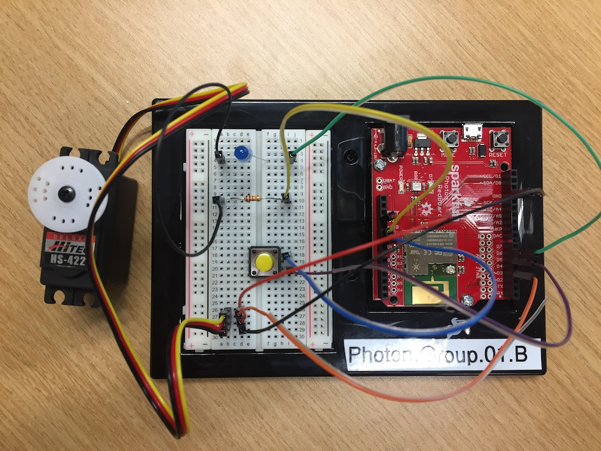

ENGRG 1050: Computer Engineering Mini-Lab
==========================================================================

 - Author: Philip Bedoukian, Christopher Batten
 - Date: October 24, 2018
 - URL: https://cornell-brg.github.io/engrg1050-mini-lab

**Tableof Contents**

 - Introduction
 - Part 1. Blinking an LED
 - Part 2. Using a Button to Blink the LED
 - Part 3a. Using an IR Sensor to Blink the LED
 - Part 3b. Using a Button to Turn Servo Motor
 - Part 4a. Using an IR Sensor to Send IoT Message
 - Part 4b. Using an IoT Message to Turn Servo Motor
 - Part 5. Putting Together the IoT System

Introduction
--------------------------------------------------------------------------

The field of computer engineering is at the interface between hardware
and software and seeks to balance the tension between application
requirements and technology constraints. This lab includes five parts
that should enable you to appreciate how hardware and software come
together to create a complete Internet-of-Things (IoT) system. The
following figure illustrates the high-level template such an IoT system.


Each IoT system is comprised of an IoT input device, IoT cloud, and IoT
output device. The IoT input device for this lab will include an infrared
(IR) rangefinder and a Particle Photon board which will monitor the
sensor and communicate to the IoT cloud. The IoT output device for this
lab will include a servo motor and a Photon board which will listen for
messages from the IoT cloud to indicate when it should turn the servo
motor. The IoT cloud will be the Particle Cloud which can be seamlessly
integrated with the Photon boards.

The final IoT system will work as follows: (1) the IoT input device will
monitor the environment for motion, and when it senses some kind of
motion it will send a message to the IoT cloud; (2) the IoT cloud will
relay this message to the IoT output device; and (3) the IoT output
device will trigger the servo motor to ring a delightfully pleasant
tabletop wind chime. This IoT system is a simple example of emerging
"smart homes" where various input and devices work together through the
cloud to automate daily tasks and (hopefully) improve the overall quality
of our lives.

We will use an incremental process to building this IoT system. First, we
will divide each group of four students into two sub-groups with two
students each. One sub-group will focus on building the IoT input device
and the other sub-group will focus on building the IoT output device.
Each sub-group will start by just building a very basic
non-internet-connected device that uses an LED and a button. The sub-groups
will then experiment with the corresponding sensor (i.e., IR rangefinder)
or actuator (i.e., servo motor). Then the sub-groups will come together
to combine the IoT input device with the IoT output device to create the
complete IoT system.

Before beginning, take a look at the materials on the lab bench which you
will be using to complete the lab. Make sure you can identify all of the
materials before continuing.

 - Particle Photon board
 - Solderless breadboard
 - Light emitting diodes (LED)
 - 1.1 kOhm resistors
 - Mechanical button
 - Jumper wires
 - Wire cutters
 - 9V battery and barrel jack adapter
 - Workstation with black USB cable
 - IR rangefinder (for IoT input sub-group)
 - Servo Motor (for IoT output sub-group)

Take a closer look at the Photon board and solderless breadboard. Notice
there are strips of female "header" along both sides of the Photon board;
you can insert jumper wires into the holes in this header in order to
connect various hardware components to the Photon board. The Photon board
can be powered either through the USB cable or via a 9V battery.

The Photon is "Arduino-compatible" which means we will be using the same
programming language as in the very popular Arduino microcontroller
platform. In order to program the Photon board, you will write your
program on the workstation using a cloud-based programming environment.
You can then download the program to the Photon board completely
wirelessly over the internet. The black USB cable is really only used to
supply power to the board, not for programming.

Part 1: Blinking an LED
--------------------------------------------------------------------------

In this part, we will start by implementing the LED circuit on the
solderless breadboard. An LED is a "light emitting diode". It is a simple
circuit component which lights up when current flows through it. A
breadboard provides a convenient way to quickly prototype circuits by
simply inserting components and wires into the breadboard holes. There is
wiring inside the breadboard which internally connects all holes in each
half-row. So all of the holes in row 1 are connected internally, all of
the holes in row 2 are connected internally, and so on. The following
photo shows the implementation of the LED circuit with a resistor and an
LED.


We need the resistor to safely limit the amount of current flowing
through the LED. Notice that we need to connect one end of the resistor
to pin D6 on the Photon board (shown using a green jumper wire in the
photo) and one end of the LED to the GND pin on the Photon board (shown
using the yellow jumper wire in the photo). Use some jumper wires to go
ahead and wire up this simple circuit. We recommend using a blue LED.
Make sure you insert the LED in the correct orientation! The shorter
"leg" of the LED should be on the left.

We will now write our very first Particle program which blinks the LED on
the breadboard. Go to <https://build.particle.io/build> and login with
the username `photon.group.0X@gmail.com` where `X` is your group number.
The password is `particle070`. You should see the Particle programming
environment. There is a set of buttons on the left. We will primarily be
using the flash button (lighting bolt icon, used for programming the
Photon board), the save button (folder icon, used for saving your program
in the cloud), the code view button (`<>` icon, used to actually enter in
your code), the console button (bar graph icon, used to monitor messages
sent to the IoT cloud), and the show devices button (target icon, used
for choosing which Photon board you want to program). Before continuing
you need to select the correct Photon board. Click on the devices button,
and click on the star next to `photon.group.0X.A` if you are an IoT input
sub-group and the start next `photon.group.0X.B` if you are an IoT output
sub-group. Then click on the code button to go to the code view.

Here is the code we will be using for the first part:

```c
// Global constants for pin assignments

int pin_led = D6;

// The setup routine runs once when you press reset

void setup()
{
  // Configure pin_led to be a digital output
  pinMode( pin_led, OUTPUT );
}

// The loop routine runs over and over again

void loop()
{
  // Turn on the LED
  digitalWrite( pin_led, LOW );

  // Wait one second
  delay(1000);

  // Turn off the LED
  digitalWrite( pin_led, HIGH );

  // Wait one second
  delay(1000);
}
```

Before continuing, we will try and understand each line of the program. A
program consists of a sequence of statements; these statements are
executed one at a time by the microcontroller to ultimately execute the
program. An Arduino program can be divided into three sections. The first
section is where we create global names for pin assignments. The second
section is the `setup` routine, and the third section is the `loop`
routine. The statements in the `setup` routine execute only once at the
very beginning of the program. The statements in the `loop` routine
execute repeatedly over and over again.

The `int pin_led = D6` statement is a variable assignment. It specifies
that the variable named `pin_led` should be assigned the value `D6`. From
then on, whenever we use the name `pin_led` it will be interpreted as the
value `D6`. We also need to specify the "type" of this variable. In this
case, the type is `int` which indicates that this variable will store
integer values. Effectively, what we are doing is saying that LED on the
breadboard is wired up to digital input `D6` on the Arduino board. Verify
that there is a wire connecting the female header location labeled "D6"
on the Photon board to one end of the resistor on the breadboard.

The `pinMode( pin_led, OUTPUT )` statement is a call to a routine which
tells the Arduino microcontroller that pin number `pin_led` (i.e., pin
number `D6`) should be configured as a digital output pin.

The `digitalWrite( pin_led, LOW )` statement is a call to a routine which
tells the Arduino to write either a logic high or a logic low value to
the pin number `pin_led`. The `delay(1000)` statement is a call to a
routine which delays execution for one second (the argument to the
routine is specified in milliseconds). These two statements turn on the
LED and wait one second. The next statements turn the LED back off and
wait another second. Since the statements in the loop execute over and
over, this program effectively turns the LED on, then off, then on, then
off, etc.

Type this program into the Particle software development environment.
Once you have entered the program, you need to give your program a title.
Click on the code button to show reveal a text box where you can enter
the title, and type in a title for this program (e.g., `engrg1050-input`
if you are the IoT input sub-group or `engrg1050-output` if you are the
IoT output sub-group). Click on the save button. Click on the flash
button to download your program to Photon. Be patient as this can take a
few seconds. Verify that the LED blinks appropriately. Feel free to
experiment with different delays to vary the blink rate.

_Sign-Off Milestone:_ Once you have the LED blinking, have an instructor
verify that things are working correctly.

Part 2. Using a Button to Blink the LED
--------------------------------------------------------------------------

In this part, we will blink the LED using a mechanical button. The
following photo shows the implementation of the LED circuit and button
circuit.


We connect two jumper wires to the button. One goes to the GND pin (shown
using a blue jumper wire in the photo), and the other goes to the D5 pin
(shown using the purple jumper wire in the photo). The Photon board will
be able to detect when the button is or is not pressed, and then we can
use the software running on the Photon board to update the status of the
LED appropriately. Use some jumper wires to go ahead and wire up this
simple circuit. Once you have added your button, then modify your code as
shown below:

```c
// Global constants for pin assignments

int pin_led    = D6;
int pin_button = D5;

// The setup routine runs once when you press reset

void setup()
{
  pinMode( pin_led,    OUTPUT       );
  pinMode( pin_button, INPUT_PULLUP );
}

// The loop routine runs over and over again

void loop()
{
  // If the button is not pressed then turn off the LED ...
  if ( digitalRead(pin_button) ) {
    digitalWrite( pin_led, HIGH );
  }

  // ... else if the button is pressed then turn on the LED
  else {
    digitalWrite( pin_led, LOW );
  }
}
```

Notice that we are configuring another pin, `pin_button`, except this
time we are configuring it as an input pin instead of an output pin. In
the `loop` routine, we check the button by calling the `digitalRead`
routine, and then we can use `digitalWrite` as in the previous part to
turn the LED on or off. Try changing the code so that when you press the
button the LED turns off and if the button is not pressed then the LED
turns on.

_Sign-Off Milestone:_ Once you have the button blinking the LED, have an
instructor verify that things are working correctly.

Part 3a. Using an IR Rangefinder to Blink the LED
--------------------------------------------------------------------------

This part is for the IoT input sub-group. If you are in an IoT output
sub-group then you should work on Part 3b. In this part, you will
experiment with the IR rangefinder, a sensor which uses infrared light to
detect the distance to an object. The following photo shows the
implementation of the IR rangefinder circuit.


We plug the IR rangefinder into the breadboard and then connect its three
pins to the Photon board. Make sure you orient the IR rangefinder pins
correctly into the breadboard (with the orange wire on top). Then connect
the orange wire of the IR rangefinder to pin A0 (shown using the orange
jumper wire in the photo), connect the red wire of the IR rangefinder to
the 3.3V pin (shown using the red jumper wire in the photo), and connect
the black wire of the IR rangefinder to the GND pin on the right side of
the Photon board (shown using the black jumper wire in the photo). You
might want to have an instructor double check your work. Once you have
added your IR rangefinder, then modify your code as shown below.

```c
// Global constants for pin assignments

int pin_led    = D6;
int pin_button = D5;
int pin_ir     = A0;

// The setup routine runs once when you press reset

void setup()
{
  pinMode( pin_led,    OUTPUT       );
  pinMode( pin_button, INPUT_PULLUP );
  pinMode( pin_ir,     INPUT        );
}

// The loop routine runs over and over again

void loop()
{
  // If the IR sense motion then turn on the LED ...
  if ( analogRead( pin_ir ) > 2000 ) {
    digitalWrite( pin_led, HIGH );
    delay(1000);
  }

  // ... else turn off the LED
  else {
    digitalWrite( pin_led, LOW );
  }
}
```

Notice that we are configuring yet another pin, `pin_ir`, for the analog
input from the IR rangefinder. In the `loop` routine, we check the IR
rangefinder by call the `analogRead` routine. If the returned value is
above a threshold, then we can assume something is in front of the IR
sensor. We can use the `digitalWrite` routine as in the previous parts to
turn the LED on or off. Try experimenting with different thresholds until
you are comfortable with the distance required to blink the LED.

_Sign-Off Milestone:_ Once you have the IR rangefinder blinking the LED,
have an instructor verify that things are working correctly.

Part 3b. Using a Button to Turn Servo Motor
--------------------------------------------------------------------------

This part is for the IoT output sub-group. If you are in an IoT input
sub-group then you should work on Part 3a. In this part, you will
experiment with the servo motor, a simple motor which can rotate to a
specified angle and then stay at that position. The following photo shows
the implementation of the servo motor circuit.



We plug the servo into the breadboard and then connect its three pins to
the Photon board. Make sure you orient the servo motor correctly into the
breadboard (with the yellow wire on top). Then connect the orange wire of
the servo motor to pin D3 (shown using the orange jumper wire in the
photo), connect the red wire of the servo motor to the 3.3V pin (shown
using the red jumper wire in the photo), and connect the black wire of
the IR rangefinder to the GND pin on the right side of the Photon board
(shown using the black jumper wire in the photo). You might want to have
an instructor double check your work. Once you have added your servo
motor, then modify your code as shown below.

```c
// Global constants for pin assignments

int pin_led    = D6;
int pin_button = D5;
int pin_servo  = D3;

// Object to control servo motor

Servo myservo;

// The setup routine runs once when you press reset

void setup()
{
  pinMode( pin_led,    OUTPUT       );
  pinMode( pin_button, INPUT_PULLUP );
  pinMode( pin_servo,  OUTPUT       );
  myservo.attach( pin_servo );
}

// The loop routine runs over and over again

void loop()
{
  // If the button is not pressed then turn the servo to 0 ...
  if ( digitalRead(pin_button) ) {
    digitalWrite( pin_led, LOW );
    myservo.write(0);
    delay(1000);
  }

  // ... else if the button is pressed then turn the servo to 90
  else {
    digitalWrite( pin_led, HIGH );
    myservo.write(90);
    delay(1000);
  }
}
```

Notice that we are configuring yet another pin, `pir_servo`, for the
output to control the servo motor. We also need to create a `Servo`
object and attach the pin to this object in the `setup` routine. In the
`loop` routine, we check if the button is pushed as before, but now if
the button is pushed we turn the servo 90 degrees. If the button is not
pushed we turn the servo to 0 degrees. Try setting the servo to turn to
different angles when the button is pressed. The minimum is 0 and the
maximum is 180 degrees.

_Sign-Off Milestone:_ Once you have the button turning the servo motor,
have an instructor verify that things are working correctly.

Part 4a. Using an IR Sensor to Send IoT Message
--------------------------------------------------------------------------

This part is for the IoT input sub-group. If you are in an IoT output
sub-group then you should work on Part 4b. You will not need to change
your circuit for this part. All we need to do is add the following line
to your program to send a message to the IoT cloud every time an object
is blocking the IR rangefinder.

```c
Spark.publish("ir","motion",10,PRIVATE);
```

This statement sends a message named "ir" to the cloud every time the IR
rangefinder returns a value above the threshold. You can verify this is
working by watching the console. Click on the console button and you
should see a "ir/motion" even show up every time you trigger the IR
rangefinder.

_Sign-Off Milestone:_ Once you have verified that your IoT input device
is able to send messages to the IoT cloud, show an instructor by using
the console.

Part 4b. Using an IoT Message to Turn Servo Motor
--------------------------------------------------------------------------

This part is for the IoT output sub-group. If you are in an IoT input
sub-group then you should work on Part 4a. You will not need to change
your circuit for this part. We need to modify our code to wait for an IoT
message, and when this message is received we want to turn the servo.
Modify your code as shown below.


```c
// Global constants for pin assignments

int pin_led    = D6;
int pin_button = D5;
int pin_servo  = D3;

// Object to control servo motor

Servo myservo;

// The setup routine runs once when you press reset

void setup()
{
  pinMode( pin_led,    OUTPUT       );
  pinMode( pin_button, INPUT_PULLUP );
  pinMode( pin_servo,  OUTPUT       );
  myservo.attach( pin_servo );
  Particle.subscribe( "ir", move_servo, MY_DEVICES );
}

// The loop routine runs over and over again

void loop()
{
  // board only does something if it receives an IoT message
}

// Function is called when an IoT message is received from IoT cloud

void move_servo( const char *event, const char *data )
{
  // Add code to ...
  // 1. Turn on the LED
  // 2. Move the servo
  // 3. Wait three seconds
  // 4. Move the servo back
  // 5. Turn off the LED
}
```

Notice that the `loop` routine is empty, and we have added a new
`move_servo` routine. The `Particle.subscribe` routine is used to tell
the IoT cloud that we would like this Photon board to receive "ir"
messages from the IoT cloud, and that when we receive such a message the
system should automatically call the `move_servo` routine. So instead of
using the `loop` routine to control our Photon board, we will instead
setup our code so that the `move_servo` routine is called whenever a
different Photon board sends the "ir" message. Fill in the `move_servo`
routine with five statements to: (1) turn of the LED; (2) move the servo
to 180 degrees; (3) wait three seconds; (4) move the servo back to zero
degrees; and (4) turn off the LED.

_Sign-Off Milestone:_ Before downloading your code to the Photon board,
have an instructor verify it is correct.

Part 5. Putting Together the IoT System
--------------------------------------------------------------------------

We are now ready to put together the IoT input device and the IoT output
device into a complete IoT system! All we need to do is have the IoT
output sub-group download their code to their Photon board. Try
triggering the IR rangefinder on the IoT input device, verify the LED on
the IoT input device goes on, use the console to see that the message was
sent into the IoT cloud, verify that the LED on the IoT output device
goes on, and then confirm that the servo rotates. Once this all works, it is now time to polish up the IoT system a bit.

First, attach the IR rangefinder to the included black L-bracket mount
and then hot glue it to the black base plate for the IoT input device.
Use the 9V battery and the corresponding battery connector to power the
IoT input device. Your IoT input device is now mobile; you can position
it anywhere around the lab or even in the hallway or atrium.

Second, attach the servo to the included aluminum brackets. Your servo
probably has a white wheel on it. Remove this white wheel and attach the
white straight piece. Hot glue the wooden rod onto this white piece so
that when the servo moves it swings the rod. Request a tabletop wind
chime from the instructors. Duct tape the servo to the lab bench so that
when the rod swings it gently rings the tabletop wind chime.

_Sign-Off Milestone:_ Have an instructor verify the whole system works.
Make a video to share with your friends!

